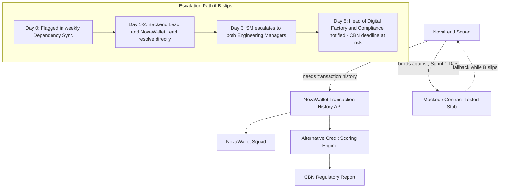

# NovaWallet Dependency Map & Escalation Path

## How this is managed day to day

- **Mock-first development:** NovaLend never fully blocks on NovaWallet's timeline — the credit-scoring engine is built and tested against a contract-tested mock from Sprint 1, Day 1, and swapped to the live API only once it's stable in staging.
- **Weekly dependency sync:** 20 minutes, Backend Lead + NovaWallet counterpart, every week without exception. The Scrum Master attends the first three to build the relationship, then steps back unless escalation is needed.
- **Escalation threshold:** a slip of more than 3 days against NovaWallet's committed date triggers escalation — this isn't a judgment call made in the moment, it's a pre-agreed number so nobody has to decide under pressure whether something "counts" as a delay worth escalating.
- **What escalation actually looks like:** see `ESCALATION_SCRIPT.md` for the exact wording used at each stage.

## Why this matters specifically for the CBN deadline

The credit-scoring engine — and therefore the entire regulatory report — sits downstream of this one API. A slip here is the single highest-severity risk in the RAID log (R1/D1) precisely because it's on the critical path and outside the squad's direct control. The mock buys time; it doesn't remove the dependency.
